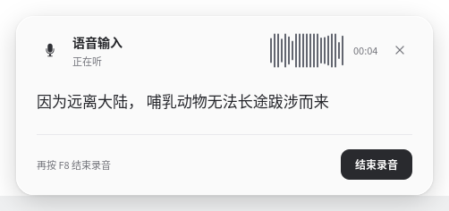
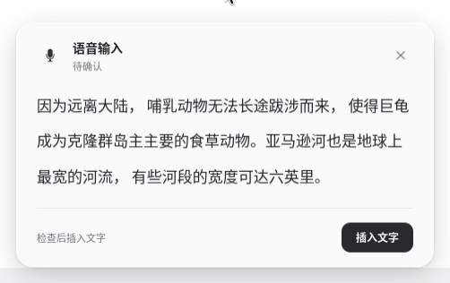
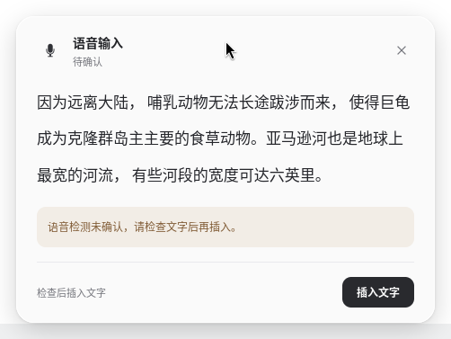
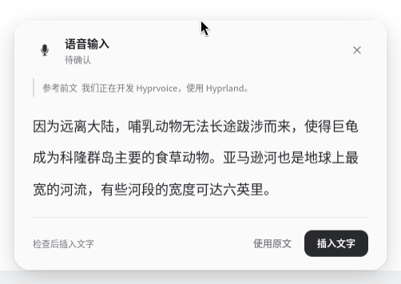
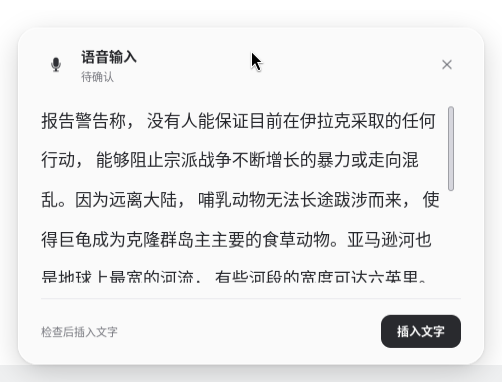
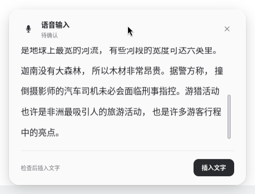
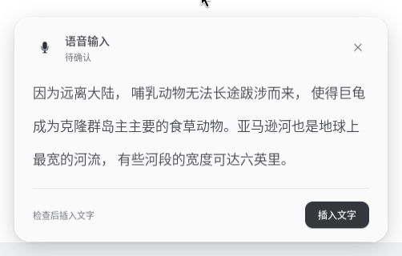
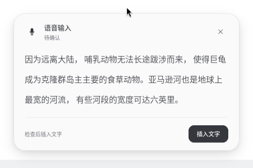
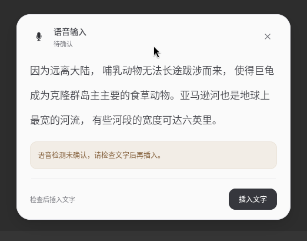
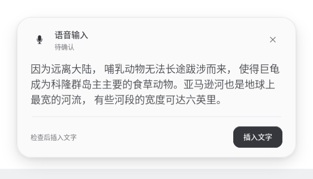

# 悬浮窗精修 · 2026-10-04

用户继续反馈界面难看后，本次重新排版悬浮窗，并精修界面文案。识别文字是面板主体，状态与操作各有独立位置。

- 浅灰白面板、深灰文字和黑色主按钮；取消移到右上角。去掉模型缩写和模式徽章，常用听写仅显示当前状态。
- 正文使用 17 px 字体与 1.65 行高。前文以细竖线标注，警告单独占一行，不再和操作按钮挤在一起。
- 不再将正文截断至 2400 字节或六行。长文本在最高 188 px 的正文区滚动，录音时跟随新文字，待确认时回到开头；滚动后不会每 80 ms 被重新设置回顶部。
- 识别处理中继续显示刚才的真实流式文字。录音起始清空上一段预览，Fun 等无流式预览的后端明确提示录音结束后显示文字。
- 状态与操作使用“正在听”“正在识别”“待确认”“结束录音”“插入文字”；快捷键提示区分按住与轻按。警告先说明用户能做什么，原始错误细节保留在悬停提示和 IPC 中。
- 录音波形由最近 21 次真实麦克风音量采样绘制，使用平方根压缩增强弱音可见度，没有模拟音频或随机动画。处理中仍使用真实忙碌状态的 spinner。
- 窗口仍不接收键盘焦点，不占独占桌面区域。待机隐藏，插入仍进入原输入框，模型、热词和用户配置保持原样。

## 实际截图

均来自隔离原生 Hyprland 中运行的正式程序。录音输入是公开 FLEURS 人声，经过真实 PipeWire 采集、已安装模型识别；不是手填转录。面板图片使用 compositor 几何位置直接截图，没有修改像素。

| 录音 | 待确认 |
| --- | --- |
|  |  |

| 处理中保留文字 | 检测未确认 |
| --- | --- |
|  |  |

| 长文本开头 | 滚动到末尾 |
| --- | --- |
|  |  |

## 验收

机器可读结果见 [ui-refresh/results.json](ui-refresh/results.json)。测试全部在专用运行目录、独立 D-Bus 和隔离 Hyprland 中完成；没有切换日常窗口或读取日常剪贴板。前文测试仅发送已授权的公开前文与公开转录给 DeepSeek。

最终精修版本的 38 项检查通过，覆盖连续录音、识别中保留预览、检测未确认、真实前文与 DeepSeek，以及 73 秒录音的实际滚动和上屏。文案精修前，同一布局的完整工作流另有 28 项检查通过，包含取消按钮、Wayland／XWayland／Kitty、焦点保护、轻按／长按和重复插入保护。

真实 GTK 按钮通过系统无障碍接口触发，验证的是正式按钮的 clicked 回调；没有注入应用状态。测试脚本会拒绝在日常桌面运行。四组已有 CTest 和 Python 语法检查通过。

此前一轮 DeepSeek 请求曾超时，程序保留识别原文并等待确认；使用本机代理重试真实公开文本处理后通过。该网络失败与界面渲染分开记录，不把保留原文当作模型成功。

这次修改针对界面与文案，没有更换模型，也不声称改变识别准确率。

## 字体进一步柔化

用户反馈字形偏硬后，正文改用 350 字重，本机匹配实际的 Noto Sans CJK SC DemiLight；正文颜色由 `#25262b` 调为深灰 `#45464c`，保留 17 px 字号，行高增至 1.7。标题及主按钮字重由 600 降至 500，主按钮背景略提亮。使用已有字体文件，没有新增字体下载或全局字体设置。

9 项真实录音、GTK 按钮、焦点与上屏检查通过，没有 GTK 渲染警告；安装的运行二进制与验收构建一致，用户配置保持原样。结果见 [字体柔化验收](ui-soft-font/results.json)。

## 组件边角精修

外层面板采用 24 px 圆角，按钮和提示条采用 12 px 圆角；关闭按钮与滚动条端部完整圆化，前文竖线和分隔线也处理了端部。浅灰 1 px 面板边框搭配轻阴影和顶部内高光，警告条加淡色细边框。外侧留白调整为上 24、下 36、左右 28 px，给阴影留出绘制空间。

浅、深色 GTK 背景均实际视觉检查；20 项真实录音、GTK 按钮、焦点及上屏检查通过，没有 GTK 样式警告。识别模型与用户配置未改动，安装构建、安装文件和运行二进制的 SHA-256 一致。记录见 [边角验收](ui-corners/results.json)。

| 浅色背景 | 深色背景与提示条 |
| --- | --- |
|  |  |

## 收紧过大的行距

用户反馈两行距离过远后检查了实际渲染。此前正文为 17 px 字号、1.7 倍行高，本机 Noto DemiLight 原始行框为 25 px；放大后约 42.5 px，实际截图相邻行间距约 42 px。[Pango 数字行高机制](https://docs.gtk.org/Pango/func.attr_line_height_new.html)放大的是逻辑行框，而不是只看字形笔画高度。

正文改为固定 26 px 行高；前文和警告分别固定为 18 px、20 px。实测文字行间距约 26 px，字重、颜色和圆角保留。9 项真实录音、按钮、焦点及上屏检查通过，无 GTK 样式警告，更新已安装，模型与用户配置未改。原图文字像素范围和字体测量结果见 [行距验收](ui-line-height/results.json)。

